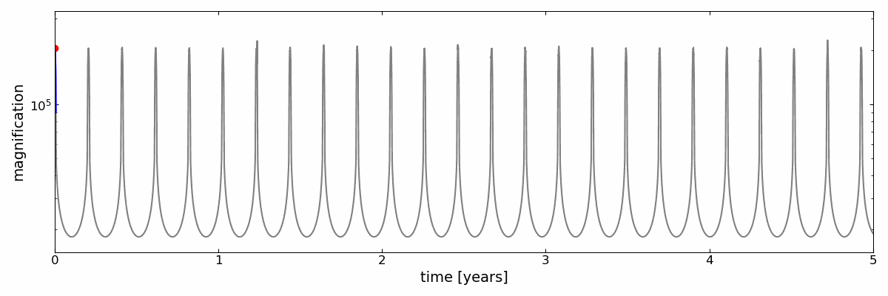

# SMBHB-Lensing-Animations

## Quasi-circular LISA binary $5\cdot10^5$ years before merger

  <table>
    <tr>
      <td align="center">
        
        
The orbits of the SMBHBS

      </td>
      <td align="center">
        
        
The caustic curve evolution. The red dot marks the position of the source drawn to scale.

      </td>
    </tr>
  </table>

  

